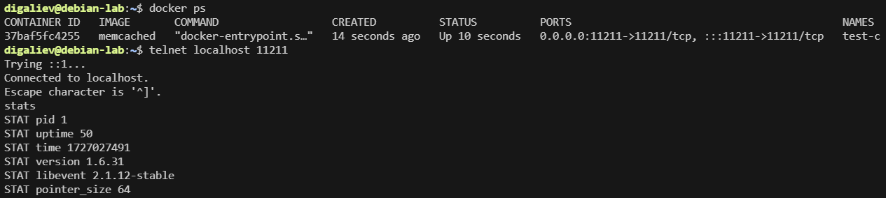
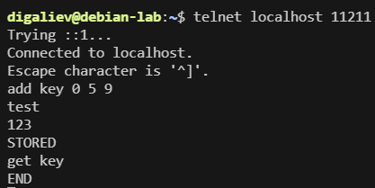
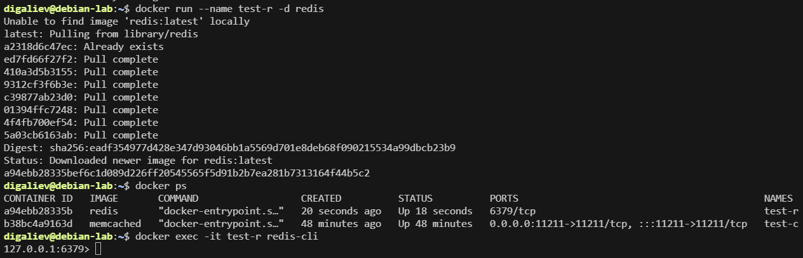
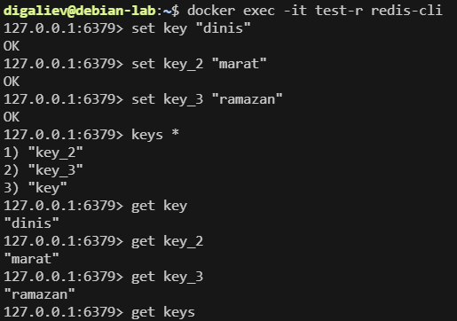
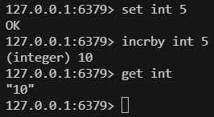

# Домашнее задание к занятию «Кеширование Redis/memcached» Галиев Д.Ф.

---

## Задание 1. Кеширование 

Приведите примеры проблем, которые может решить кеширование. 

*Приведите ответ в свободной форме.*

### Решение 1

Кеширование решает следующие проблемы:

● Повышение производительности, достигается за счет складывания в кэш данных, к которым чаще всего происходит обращение;

● Увеличение скорости ответа;

● Экономия ресурсов базы данных, например, применяя кэширование тяжелых запросов;

● Сглаживание бустов при резком увеличение трафика;

Кэширование это очень мощный и простой в использовании механизм, который позволяет значительно увеличить производительность системы.

---

## Задание 2. Memcached

Установите и запустите memcached.

*Приведите скриншот systemctl status memcached, где будет видно, что memcached запущен.*

### Решение 2

Запустил memcashed в docker:

---

### Задание 3. Удаление по TTL в Memcached

Запишите в memcached несколько ключей с любыми именами и значениями, для которых выставлен TTL 5. 

*Приведите скриншот, на котором видно, что спустя 5 секунд ключи удалились из базы.*

### Решение 3

Записываем в memcached несколько ключей, для которых выставлен TTL 5 и проверяем, что спустя 5 секунд ключи удалились из базы:

---

### Задание 4. Запись данных в Redis

Запишите в Redis несколько ключей с любыми именами и значениями. 

*Через redis-cli достаньте все записанные ключи и значения из базы, приведите скриншот этой операции.*

### Решение 4

Выполняем загрузку образа Redis в Docker, запускаем контейнер, проверяем что контейнер запустился, подключаемся через redis-cli:

Записываем в Redis несколько ключей, и через redis-cli достаем все записанные ключи и значения из базы:

---

## Дополнительные задания (со звёздочкой*)
Эти задания дополнительные, то есть не обязательные к выполнению, и никак не повлияют на получение вами зачёта по этому домашнему заданию. Вы можете их выполнить, если хотите глубже разобраться в материале.

### Задание 5*. Работа с числами 

Запишите в Redis ключ key5 со значением типа "int" равным числу 5. Увеличьте его на 5, чтобы в итоге в значении лежало число 10.  

*Приведите скриншот, где будут проделаны все операции и будет видно, что значение key5 стало равно 10.*

### Решение 5*

---

